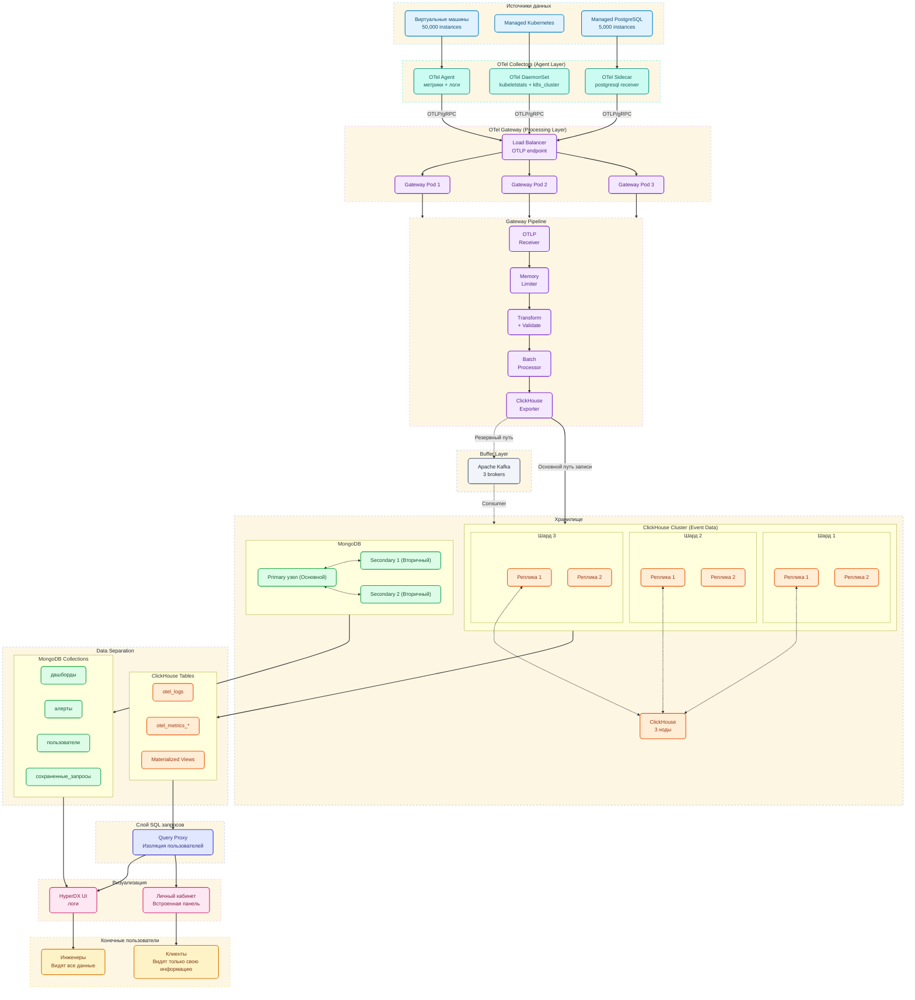

## ОБЪЯСНЕНИЕ ЖИЗНЕННОГО ЦИКЛА ДАННЫХ ТЕЛЕМЕТРИИ

### Шаг 1. Уровень сбора данных

На ресурсах (Virtual Machines, узлы Managed Kubernetes, инстансы Managed PostgreSQL) развернуты агенты **OTel Collector**.

Их основная функция — непрерывный парсинг логов и получение метрик. Агент осуществляет первичную компоновку данных и их передачу по протоколу OTLP (OpenTelemetry Protocol) на уровень централизованной обработки через защищенное gRPC-соединение.

###  Шаг 2. Уровень агрегации и обработки

Для обеспечения высокой доступности и обработки интенсивного входящего потока данных применяется кластерный **OTel Gateway**.

Входящий трафик распределяется через балансировщик нагрузки (**Load Balancer**) между подами шлюза. Внутри каждого шлюза настроен конвейер обработки данных, состоящий из следующих компонентов:

- **Memory Limiter Processor**: реализует механизм backpressure, предотвращая падение узлов шлюза от OOM во время пиковых нагрузок.
[Memory Limiter Processor](https://github.com/open-telemetry/opentelemetry-collector/tree/main/processor/memorylimiterprocessor)

- **Transform Processor**: выполняет бизнес-логику обогащения данных. Используя язык OTTL (OpenTelemetry Transformation Language), процессор принудительно инжектирует атрибут tenant_id в метаданные телеметрии для обеспечения строгой мультитенантности.
[Transform Processor](https://github.com/open-telemetry/opentelemetry-collector-contrib/tree/main/processor/transformprocessor)

- **Filter Processor**: выполняет бизнес-логику оптимизации затрат. Процессор оценивает поле SeverityNumber лог-записей и отбрасывает события уровней INFO, DEBUG и TRACE, пропуская в хранилище только события (WARN, ERROR).
[Filter Processor](https://opentelemetry.io/docs/specs/otel/logs/data-model/#field-severitynumber)

- **Batch Processor**: Выполняет агрегацию непрерывного потока мелких событий в батчи, что предотвращает избыточную фрагментацию данных на диске Clickhouse (проблема *Too many parts*).
[Batch Processor](https://github.com/open-telemetry/opentelemetry-collector/tree/main/processor/batchprocessor)

- **ClickHouse Exporter**: специализированный компонент OpenTelemetry Collector, обеспечивающий финальную конвертацию и передачу телеметрических данных в целевое хранилище.
[OpenTelemetry ClickHouse Exporter](https://github.com/open-telemetry/opentelemetry-collector-contrib/tree/main/exporter/clickhouseexporter)

###  Шаг 3. Уровень буферизации

Для обеспечения надежности и реализации стратегии **Zero Data Loss** (нулевая потеря данных) внедрен промежуточный слой буферизации на базе **Apache Kafka**.

 Слой работает в рамках двухконтурной схемы:

1.  **Основной контур:** в штатном режиме сформированные батчи передаются из OTel Gateway напрямую в ClickHouse Cluster для обеспечения минимальной задержки отображения данных.

2.  **Контур отказоустойчивости:** в случае временной недоступности БД, сетевых сбоев, ClickHouse Exporter автоматически перенаправляет поток данных в топики Kafka.

3. **Механизм восстановления**: после восстановления БД данные асинхронно вычитываются из Kafka через Kafka Table Engine.

### Шаг 4. Уровень хранения данных
Архитектура хранилища предусматривает разделение событийных данных и состояния приложения:

- **ClickHouse (хранение данных)** для хранения метрик и логов. Для обеспечения масштабируемости и отказоустойчивости применяется шардирование и репликация данных. Кроме таблиц, создаются материализованные представления для автоматического вычисления статистических показателей в момент записи данных.

- **MongoDB (хранение информации о состоянии приложения)** для хранения метаданных: профилей пользователей, политик доступа, конфигураций дашбордов и правил алертинга.

Для отказоустойчивости используется схема Replica Set. В случае выхода из строя Primary-узла, система проводит автоматические выборы нового лидера, что гарантирует доступность Личного кабинета 24/7.

### Шаг 5. Уровень доступа к данным и безопасности

Прямой доступ к аналитической БД ClickHouse из внешних сетей строго запрещен. Для изоляции данных между клиентами применяется паттерн **Backend API (или Query Proxy)**:

**Backend API личного кабинета (Query Proxy)**: собственный микросервис облачного провайдера. Выступает единой точкой входа для запросов от клиентских веб-интерфейсов. При получении запроса на построение графика, микросервис валидирует JWT-токен пользователя, определяет его принадлежность к конкретному пользователю и принудительно инжектирует в формируемый SQL-запрос фильтр WHERE tenant_id = '<ID_клиента>'.

### Шаг 6. Уровень визуализации
Взаимодействие с данными разделено на два потока в зависимости от роли пользователя:

**Клиенты:** используют встроенный интерфейс Личного кабинета. Бэкенд кабинета самостоятельно запрашивает агрегированные метрики из ClickHouse по API, применяя жесткую фильтрацию по tenant_id, и отрисовывает базовые графики ресурсов.

**Инженеры поддержки**: Используют HyperDX UI для прямого доступа к глобальной базе телеметрии ClickHouse.